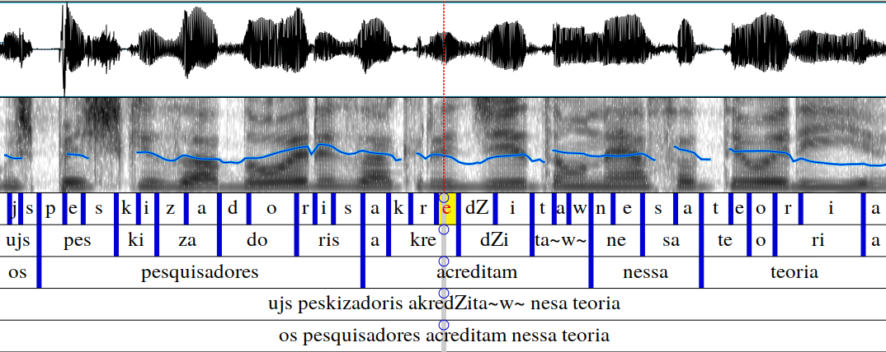
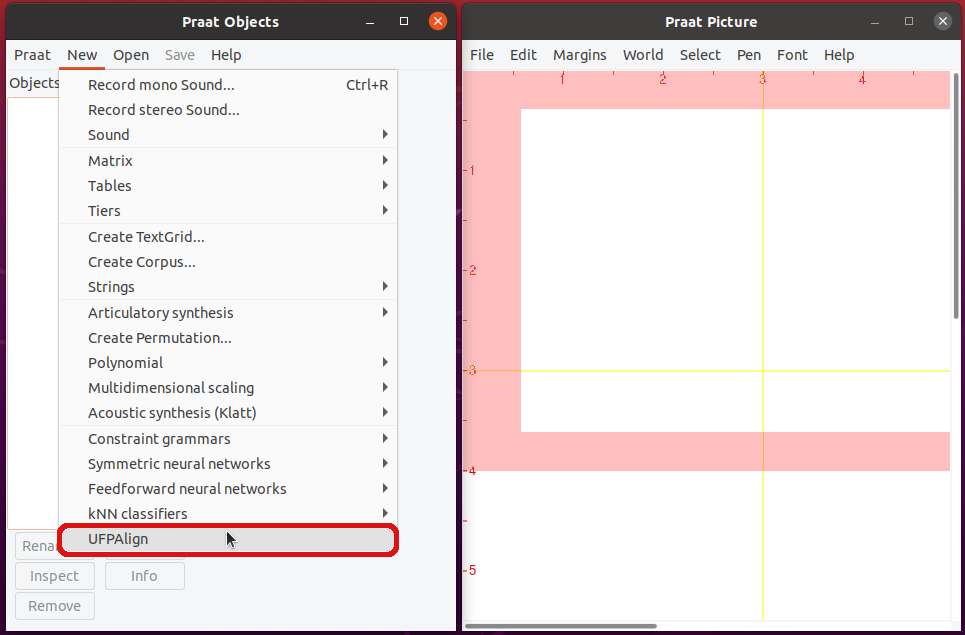

# UFPAlign: Forced Phonetic Alignment :brazil:

UFPAlign is an open-source automatic phonetic alignment tool for Brazilian 
Portuguese that uses the [Kaldi toolkit](http://kaldi-asr.org/) for performing 
forced alignment of speech datasets. The UFPAlign is distributed as a plugin 
for [Praat](https://www.fon.hum.uva.nl/praat/), a popular free software package 
for speech analysis in phonetics. The plugin is directly accessible from the 
Praat menus and it allows to align speech from an audio file and its 
orthographic transcription with a few minor manual steps. The result is a 
multi-level annotation TextGrid containing phonemes, syllables, words, 
phonetic and orthographic information as below. 

:warning: The routine that generates the syllabic tier was discontinued.



:brazil: [Acesse a documentação em Português Brasileiro](README.md)

## Requirements

:warning: Currently, UFPAlign works under Linux environments only.

This assumes a installation on a
Debian-based OS like Ubuntu, so the default package manager will be `apt`.

<details>
<summary>Kaldi Installation</summary>

First, clone the most current version of Kaldi from GitHub by typing the 
following into a shell:

```bash
$ git clone https://github.com/kaldi-asr/kaldi
```

Then, to install Kaldi tools, go to `kaldi/tools/` and first check the 
prerequisites for Kaldi and see if there are any system-level installations 
you need to do:

```bash
$ cd kaldi/tools
$ extras/check_dependencies.sh
```
Check the output carefully and install any prerequisites missing, like
`automake`, `svn`, and other stuff Kaldi depens on. :warning: The only
dependency you gotta ignore is Intel MKL library for linear algebra, as we'll
install another one later :warning:

Then, assuming you have 4 CPU cores available on your machine, run:

```bash
$ make -j 4
```

The last tool to install is OpenBLAS, the open-source linear algebra library
that can be used instead of Intel MKL. Beware this will use all cores on your
machine, even the hyperthreads if your processor has support to it.

```bash
$ extras/install_openblas.sh
```

Finally, install Kaldi `src`. No CUDA support is necessary.

```bash
$ cd kaldi/src
$ ./configure --shared
$ make depend -j 4
$ make -j 4
```

To guarantee Kaldi installation was successful, run the scripts on the yes/no
dataset. It doesn't take long to finish since the dataset is pretty small and
the pipeline only trains and decodes a monophone-bases model.

```bash
$ cd kaldi/egs/yesno/s5
$ bash run.sh
```

The last line should print the word error rate:

```text
%WER 0.00 [ 0 / 232, 0 ins, 0 del, 0 sub ] exp/mono0a/decode_test_yesno/wer_10_0.0
```
</details>

<details>
<summary>Praat Installation</summary>
To install the Linux version of Praat, you can either use `apt-get` by typing
into a shell:

```bash
$ sudo apt-get install praat
```

Or you can download a 64-bit binary executable on the 
[Praat download page](https://www.fon.hum.uva.nl/praat/praat6141_linux64.tar.gz).
Then, unpack it, creating the executable file praat. You can remove the tar
file.
</details>

<details>
<summary>Python dependencies</summary>
Other dependencies can be installed using Python's `pip` utility:

```bash
$ pip install requirements.txt
```
</details>


## Usage

### As a Praat Plugin (GUI)

UFPAlign works fine under Linux environments via command line, but also 
provides a graphical interface as a plugin to Praat. In order to use the 
plugin, open the `New` menu and click on the `UFPAlign` option, the following 
initial window will be displayed. Click on the `Choose...` buttons to select 
the path to Kaldi's root directory, an audio file  and the corresponding 
orthographic transcription. You can also choose an acoustic model, that will 
be used to perform the alignment, among the five architecture available as 
option. After selecting them, click on `Align` button. Then, wait while the 
file is aligned. This may take a while.




When the alignment is successful finished, the aligner offers the option to 
promptly display the current resulting TextGrid in the Praat interface or to 
proceed to align a new audio file. 

The figure at the top of this README file shows the Praat's
TextGrid editor displaying an audio file waveform followed by its 
spectrogram and its aligner's resulting multi-tier TextGrid containing five 
tiers: phonemes, syllables, words, phonetic transcription and orthographic 
transcription, respectively. 

Praat's TextGrid editor itself plots the waveform and spectrogram from the 
audio file, it is not content of the TextGrid file. 
Kaldi provides the vertical blue dashes, which correspond to the time marks, 
while FalaBrasil's NLP library provides the phonetic and syllabic 
transcriptions. Whether you decide to immediately open the result TextGrid in 
Praat interface or not, the TextGrid file will be saved inside a directory 
named textgrid at your home directory with the same name as the audio file you 
choose to align.

### From Command Line (CLI)

Just execute file `ufpalign.sh`. With no arguments, it prints a help message.
The following command works perfectly using the monophone model, though:

```bash
$ KALDI_ROOT=$HOME/kaldi bash ufpalign.sh demo/ex.wav demo/ex.txt mono
```

File [`demo/M-001.log`](demo/M-001.log) contains an example of output from a
real execution.

### Docker :whale:

Details on directory `docker/execution`.


## Simulation and Results

In order to provide a minimum level of reproducibility of the results, the
directory `simulation` was created with scripts to execute MFA and other
HTK-based older aligners over the same dataset, so as to assess by comparison 
the "accuracy" of UFPAlign.

We recommend the use of the docker image in `docker/simulation`.


## Citation

If you use any of the resources provided on this repository, please cite us
as the following:

### [EURASIP 2022](https://asp-eurasipjournals.springeropen.com/articles/10.1186/s13634-022-00844-9)

> Batista, C., Dias, A.L. & Neto, N.
> Free resources for forced phonetic alignment in Brazilian Portuguese based on Kaldi toolkit.
> EURASIP J. Adv. Signal Process. 2022, 11 (2022).
> https://doi.org/10.1186/s13634-022-00844-9

```bibtex
@article{Batista22a,
    author     = {Batista, Cassio and Dias, Ana Larissa and Neto, Nelson},
    title      = {Free resources for forced phonetic alignment in Brazilian Portuguese based on Kaldi toolkit},
    journal    = {EURASIP Journal on Advances in Signal Processing},
    year       = {2022},
    month      = {Feb},
    day        = {19},
    volume     = {2022},
    number     = {1},
    pages      = {11},
    issn       = {1687-6180},
    doi        = {10.1186/s13634-022-00844-9},
    url        = {https://doi.org/10.1186/s13634-022-00844-9}
}
```

Check also the
[FalaBrasil's repository for training acoustic models with Kaldi](https://github.com/falabrasil/kaldi-br).


[](https://ufpafalabrasil.gitlab.io/ "Visite o site do Grupo FalaBrasil") [](https://portal.ufpa.br/ "Visite o site da UFPA")

__Grupo FalaBrasil (2024)__ - https://ufpafalabrasil.gitlab.io/      
__Universidade Federal do Pará (UFPA)__ - https://portal.ufpa.br/     
Cassio Batista - https://cassiotbatista.github.io    
Larissa Dias   - larissa.engcomp@gmail.com     
