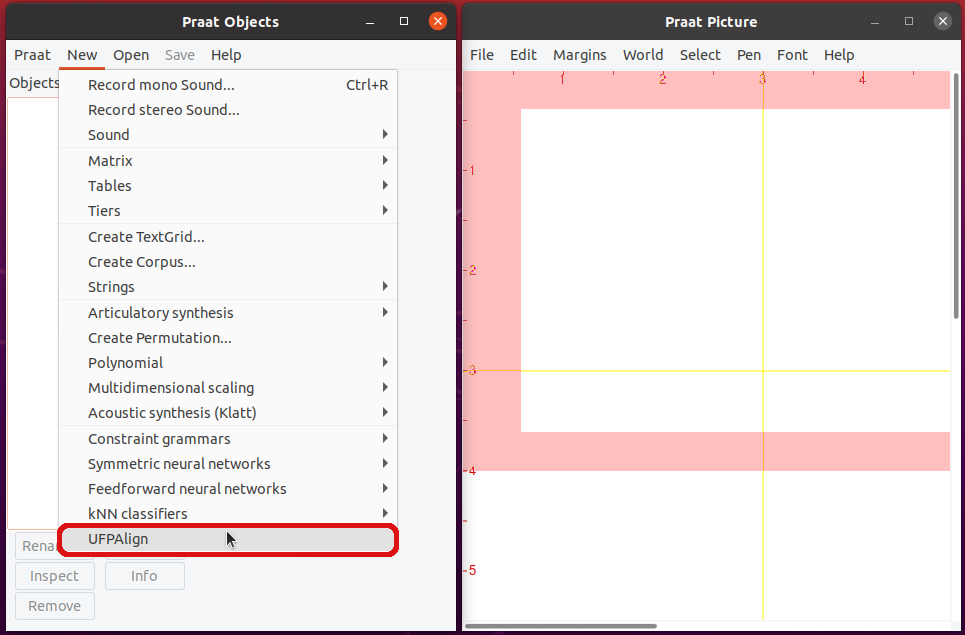

# UFPAlign: Alinhamento Fonético Forçado :brazil:

O UFPAlign é uma ferramenta de código aberto para alinhamento fonético
automático do Português Brasileiro utilizando o pacote de ferramentas 
[Kaldi](http://kaldi-asr.org/). O UFPAlign é disponibilizado como um plugin 
para o [Praat](https://www.fon.hum.uva.nl/praat/), sendo acessível diretamente 
do menu do Praat e executa o alinhamento a partir de um arquivo de áudio e sua
transcrição ortográfica com algumas poucas etapas manuais. O resultado é um
TextGrid multi-nível contendo fonemas, sílabas, palavras, transcrições
fonéticas e ortográficas conforme a figura abaixo.


:uk: [Check the documentation in English](README.en.md)

## Dependências

:warning: Atualmente, o UFPAlign funciona em sistemas operacionais Linux.

Aqui, assume-se uma instalação em um sistema operacional
baseado no Debian, então o gerenciador de pacotes padrão será o `apt`.

<details>
<summary>Kaldi</summary>

Primeiro, clone a versão mais atual do Kaldi do GitHub digitando no
terminal:

```bash
$ git clone https://github.com/kaldi-asr/kaldi
```

O próximo passo é a instalação do `tools` do Kaldi. No diretório 
`kaldi/tools/`, verifica se algum pré-requisitos do Kaldi ainda precisa ser
instalado:

```bash
$ cd kaldi/tools
$ extras/check_dependencies.sh
```

Se houver algum requisito faltando, o comando deve te informar o passo para
instalá-lo. O passo seguinte é a compilação dos requisitos com o `make`:

```bash
$ make
```

Se tiveres várias CPUs e quiseres acelerar as coisas, podes rodar o passo
anterior paralelamente usando o parâmetro `-j`. Por exemplo, para usar 4 CPUs:

```bash
$ make -j 4
```

O último pacote a ser instalado é a OpenBLAS, uma biblioteca open-source de
álgebra linear que pode ser utilizada no lugar da Intel MKL. Cuidado que isso
irá utilizar todos os cores da tua máquina, até mesmo as hyperthreads caso o
processador suporte.

```bash
$ extras/install_openblas.sh
```

Finalmente, podes intalar o Kaldi `src`.

```bash
$ cd kaldi/src
$ ./configure --shared
$ make depend -j 4
$ make -j 4
```

Para testar se a instalação do Kaldi foi bem-sucedida, podes executar os
scripts do corpus `yes/no`. A execução é rápida, pois o conjunto de dados é
muito pequeno e o pipeline apenas treina e decodifica um modelo baseado em
monofones.

```bash
$ cd kaldi/egs/yesno/s5
$ bash run.sh
```

A última linha da execução deverá printar a taxa de erro por palavra (WER): 

```text
%WER 0.00 [ 0 / 232, 0 ins, 0 del, 0 sub ] exp/mono0a/decode_test_yesno/wer_10_0.0
```
</details>

<details>
<summary>Praat</summary>

Em ambientes Linux, podes instalar o Praat usando o `apt-get` rodando o comando:

```bash
$ sudo apt-get install praat
```

Ou podes baixar o executável 64-bit na página de [download do
Praat](https://www.fon.hum.uva.nl/praat/praat6141_linux64.tar.gz). Depois de
baixá-lo, deves descompactar dentro de uma pasta. Pronto, apenas clique no
executável para usar o Praat. O `*.tar.gz` pode ser deletado.
</details>

<details>
<summary>NLP-generator</summary>

Primeiro, deves clonar o repositório NLP-generator do Gitlab dentro do diretório
home (:warning: O NLP-generator precisa ser clonado dentro da home para que
o UFPAlign funcione corretamente).

```bash
$ git clone https://gitlab.com/fb-nlp/nlp-generator.git
```

O NLP-generator foi desenvolvido em Java, mas recentemente foi atualizado para
também funcionar em Python graças ao módulo
[PyJNIus](https://github.com/kivy/pyjnius), o qual permite que os metódos em
Java sejam  importados pelo Python. Portanto, para instalar os requisitos de
NLP, precisar baixar e instalar o [Anaconda] (https://www.anaconda.com/) para
Python 3. Baixa e execita o instalador Anaconda no navegador para Linux 
diretamente do site do Anaconda:

```bash
$ bash Anaconda3-2020.11-Linux-x86_64.sh 
```

Agora podes instalar os requisitos restantes usando `conda`:

```bash
$ conda install cython
$ sudo conda install -c conda-forge pyjnius
$ sudo conda install -c anaconda openjdk
$ pip3 install PyICU
```

Certifique-se de que todos os requisitos sejam atendidos digitando no terminal:

```bash
$ pip3 list | grep -iE 'jni|cython|pyicu'
```

O último comando deve imprimir a saída:

```bash
$ pip3 list | egrep -i 'jni|cython|pyicu'
Cython                             0.29.21
PyICU                              2.6
pyjnius                            1.2.1
```

Finalmente, atenta para que a variável de ambiente `JAVA_HOME` aponte
para Java 8 (ou versão mais recente) do Anaconda como o exemplo abaixo:

```bash
$ echo $JAVA_HOME 
/home/cassio/anaconda3
```
</details>


## Instruções de Uso

### Plugin do Praat (GUI)

Para usar o plugin, abra o menu `New` e clique na opção `UFPAlign`, a seguinte
janela inicial será exibido. Clique nos botões `Choose...` para selecionar o
caminho para o diretório raiz do Kaldi, um arquivo de áudio e
sua correspondente transcrição ortográfica. Podes também escolher a
arquitetura do modelo acústico que será usado para realizar o alinhamento.
Após selecioná-los, clica no botão `Alinhar`. Isso deve demorar um pouco.



Quando o alinhamento é concluído com sucesso, o alinhador oferece a opção de
exibir imediatamente o TextGrid resultante na interface do Praat ou prosseguir
para alinhar um novo arquivo de áudio.

A figura no início desse documento mostra o editor de TextGrid do Praat 
exibindo uma forma de onda do arquivo de áudio seguida por seu espectrograma 
e o TextGrid multicamadas resultante de alinhamento contendo cinco camadas: 
fonemas, sílabas, palavras, transcrição fonética e transcrição ortográfica, 
respectivamente.

O próprio editor TextGrid do Praat plota a forma de onda e o espectrograma do
arquivo de áudio, esta informação não é conteúdo do arquivo TextGrid. O Kaldi
fornece os traços azuis verticais, que correspondem às marcas de tempo,
enquanto a biblioteca de NLP do FalaBrasil fornece as transcrições fonéticas e
silábicas. Decidindo abrir imediatamente o TextGrid resultante na
interface Praat ou não, o arquivo TextGrid será salvo dentro de um diretório
chamado textgrid no diretório inicial com o mesmo nome do arquivo de áudio
que escolheste alinhar.

### Linha de Comando (CLI)

Basicamente tens de executar o arquivo `ufpalign.sh`. Sem nenhum argumento, ele
printa uma mensagem de ajuda. O comando abaixo funciona perfeitamente
utilizando o modelo monofone:

```bash
$ bash ufpalign.sh $HOME/kaldi demo/ex.wav demo/ex.txt mono
```

O arquivo [`demo/M-001.log`](demo/M-001.log) contém um exemplo de saída
completa do comando funcionando.

## Citação

Se utilizares qualquer recurso disponível nesse repositório, por favor nos cite
com as seguintes referências:

### [BRACIS 2020](https://link.springer.com/chapter/10.1007/978-3-030-61377-8_44)

> Dias A.L., Batista C., Santana D., Neto N. (2020)
> Towards a Free, Forced Phonetic Aligner for Brazilian Portuguese Using Kaldi Tools.
> In: Cerri R., Prati R.C. (eds) Intelligent Systems. BRACIS 2020.
> Lecture Notes in Computer Science, vol 12319. Springer, Cham.
> https://doi.org/10.1007/978-3-030-61377-8_44

```bibtex
@InProceedings{Dias20,
    author     = {Dias, Ana Larissa and Batista, Cassio and Santana, Daniel and Neto, Nelson},
    editor     = {Cerri, Ricardo and Prati, Ronaldo C.},
    title      = {Towards a Free, Forced Phonetic Aligner for Brazilian Portuguese Using Kaldi Tools},
    booktitle  = {Intelligent Systems},
    year       = {2020},
    publisher  = {Springer International Publishing},
    address    = {Cham},
    pages      = {621--635},
    isbn       = {978-3-030-61377-8}
}
```

:warning: Este artigo usa as receitas `nnet2` desatualizadas, porém este
repositório foi atualizado para a receita dos chain models por meio de scripts
`nnet3`. O `nnet2` scripts, podem ser encontrados na tag `nnet2` no
[repositório do FalaBrasil com os scripts de treinamento de modelos acústicos usando o Kaldi](https://github.com/falabrasil/kaldi-br).

[](https://ufpafalabrasil.gitlab.io/ "Visite o site do Grupo FalaBrasil") [](https://portal.ufpa.br/ "Visite o site da UFPA")

__Grupo FalaBrasil (2022)__ - https://ufpafalabrasil.gitlab.io/      
__Universidade Federal do Pará (UFPA)__ - https://portal.ufpa.br/     
Cassio Batista - https://cassota.gitlab.io/    
Larissa Dias   - larissa.engcomp@gmail.com     
