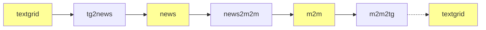
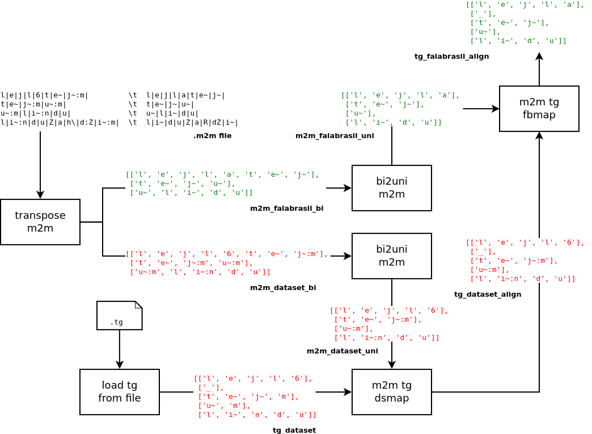

# Map G2P Script

```text
  ___        _            __       _       _       
 / _ \ _   _| |_    ___  / _|   __| | __ _| |_ ___ 
| | | | | | | __|  / _ \| |_   / _` |/ _` | __/ _ \
| |_| | |_| | |_  | (_) |  _| | (_| | (_| | ||  __/
 \___/ \__,_|\__|  \___/|_|    \__,_|\__,_|\__\___|
```

:warning: this was created as a first alignment effort for BRACIS 2020 and soon
became out of date in favour of the new `ds2fb` scripts. Check that out under
the parent dir.

As everybody knows this `male-female` data set does not use the same set of
phonemes that we are used to from our `nlp-generator`. Therefore, some kind of
mapping needs to be executed in order to convert the set of phonemes used in
this data set to the ones used in the FalaBrasil group. The problem is this
mapping is not often one-to-one, so for example the pair of phonemes `/t/ /S/` 
from the data set are mapped to a single phoneme `/tS/` in the FalaBrasil.

A script called `tg2news.py` converts a textgrid into the news format, which is
basically a mapping format from one character chain to another. In order to
build the `news` file, we need both the set of phonemes of the current dataset,
as well as the FalaBrasil phonemes.



The [M2M aligner](https://github.com/letter-to-phoneme/m2m-aligner) receives a 
file in the `news` format and outputs the alignment in a format which I called 
`m2m`, such conversion performed by script `news2m2m.py`. Finally a script
called `m2m2tg.py` generates from a m2m file a texgrid file, which is mapped 
to the FalaBrasil phonemes.

```text
==> res/ali.m2m <==                                         ==> res/ali.news <==
6|k|e|s|t|a~|w~|              a|k|e|s|t|a~|w~|              6 k e s t a~ w~               a k e s t a~ w~
k|e|s|t|a~|w~|f|o|j|          k|e|s|t|a~|w~|f|o|j|          k e s t a~ w~ f o j           k e s t a~ w~ f o j
f|o|j|h/|e|t|o~|m|a|d|6|      f|o|j|R|e|t|o|m|a|d|a|        f o j h/ e t o~ m a d 6       f o j R e t o m a d a
h/|e|t|o~|m|a|d|6|n|u|        R|e|t|o|m|a|d|a|n|u|          h/ e t o~ m a d 6 n u         R e t o m a d a n u
n|u|k|o~:n|g|4|E|s|u|         n|u|k|o~|g|r|E|s|u|           n u k o~ n g 4 E s u          n u k o~ g r E s u
@|                            @|                            @                             @
l|e|j|l|6|t|e~|j~:m|          l|e|j|l|a|t|e~|j~|            l e j l 6 t e~ j~ m           l e j l a t e~ j~
t|e~|j~:m|u~:m|               t|e~|j~|u~|                   t e~ j~ m u~ m                t e~ j~ u~
u~:m|l|i~:n|d|u|              u~|l|i~|d|u|                  u~ m l i~ n d u               u~ l i~ d u
l|i~:n|d|u|Z|a|h\|d:Z|i~:m|   l|i~|d|u|Z|a|R|dZ|i~|         l i~ n d u Z a h\ d Z i~ m    l i~ d u Z a R dZ i~
@|                            @|                            @                             @
```

The script `m2m2tg.py` is the most complex one and is depicted in the following
pipeline:



Scrips `run.sh` call all other scripts in the order of execution.

## Disclaimer

Functions `map_*_m2m_to_tg()` from `m2m2tg.py` **do not** perform reliable
convertions for syllphones, which means that right now the output textgrid
cannot be loaded back into the TextGrid class because the syllphones do not
match the FalaBrasil phonemes (it yields an error at the `upper()` method),
which need phonemes and syllphones to match the same set of phonemes of
wordphones).

[](https://ufpafalabrasil.gitlab.io/ "Visite o site do Grupo FalaBrasil") [](https://portal.ufpa.br/ "Visite o site da UFPA")

__Grupo FalaBrasil (2020)__ - https://ufpafalabrasil.gitlab.io/      
__Universidade Federal do Pará (UFPA)__ - https://portal.ufpa.br/     
Cassio Batista - https://cassota.gitlab.io/    
