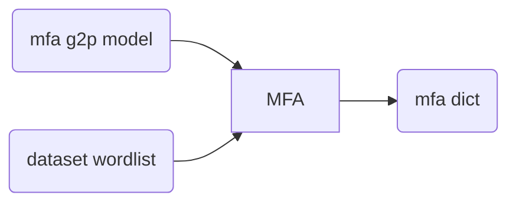

# EURASIP Simulations for MFA

- [`align_only/`](./align_only): contains scripts to generate textgrids via MFA
  using MFA's default pretrained acoustic and pronunciation models for
  Portuguese over both male and female datasets.
- [`train_and_align/`](./train_and_align): contains scripts to generate
  textgrids by MFA, but using both male and female datasets as training set to 
  generate the acoustic model as well. The phonetic dictionary used was the 
  default generated by MFA's pretrained G2P model for Portuguese.
- :warning: [`falabrasil_trisat/`](./falabrasil_trisat): contains script to generate PTS
  files using an triphone-based SAT acoustic model trained over all the
  FalaBrasil corpora. Unfortunately this didn't work out very well (yet).


## Generate dict via MFA's pretrained pronunciation model (Pynini ARPAbet)

:warning: the dict complains at words with the `à` char, which luckily happen
to be only two: `à` and `às`. Therefore I removed them manually from the word
lists, then just re-inserted them back at the dict manually later.



:warning: this assumes you have already [installed MFA 2.0.\* under an Anaconda
virtual environment](https://montreal-forced-aligner.readthedocs.io/en/latest/installation.html).

```bash
(aligner) $ mfa g2p \
  $HOME/Documents/MFA/pretrained_models/g2p/portuguese_g2p.zip \
  $HOME/fb-gitlab/fb-audio-corpora/male-female-aligned/wlist.txt \
  $HOME/fb-gitlab/fb-audio-corpora/male-female-aligned/scripts/21_eurasip_mfa/dict_mfa.dict
```

## Results

TBD.
