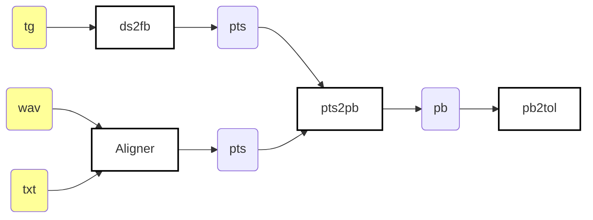

# Scripts

- [`ds2fb/`](./ds2fb): Parses TextGrid files' phonetic tier into a new format 
  called **p**honetic **t**ime**s**tamp (PTS for short), which is much 
  simpler and easy to parse later than a full TextGrid for phone boundary 
  calculation. It also performs a conversion from the original phoneset of the
  hand-aligned datasets to FalaBrasil's. This is an up-to-date version of the 
  `g2p_map` scripts. See "[Disclaimer](#disclaimer)" section.
- [`20_bracis_kaldi/`](./20_bracis_kaldi): parses CTM files previously 
  generated by Larissa from out `fb-align/kaldi-align` repo scripts into PTS
  files, since the models were lost when we lost the backup HDD 
  (deceased in 2020, the partition simply won't mount). Fortunately, the CTM 
  files were stored in this repo under `{male,female}/20_bracis_kaldi/*/ctm/` 
  dirs. However since most models are being trained from scratch now following 
  Mini-librispeech recipe, this should not be used any longer in the future.
  This align may be usually referred also as UFPAlign 2.0.
- [`21_eurasip_htk/`](./21_eurasip_htk): generates `.rec` from Iago's aligner 
  (UFPAlign v1.0) and EasyAlign, both based on HVite. Then some pipeline of 
  scripts parse REC into PTS files.
- [`21_eurasip_mfa/`](./21_eurasip_mfa): generates TextGrid files using MFA
  aligner, which is Kaldi-based. MFA outputs phonemes in ARPAbet format, so the
  pipeline parses TextGrid into PTS, and also converts the phoneset to
  FalaBrasil's SAMPA-based.
- [`21_eurasip_kaldi/`](./21_eurasip_kaldi): generates CTM files using
  FalaBrasil-trained acoustic models with Kaldi. The pipeline then converts
  such files into PTS. The whole pipeline from model training is considered
  here (i.e., from monophones onwards).
- [`21_eurasip_gentle/`](./21_eurasip_gentle): TBD, didn't work.


## Requirements

https://github.com/MontrealCorpusTools/Montreal-Forced-Aligner/issues/259#issuecomment-879523290

```bash
$ conda create --name mfa -c conda-forge openblas python=3.8 openfst pynini ngram baumwelch
$ conda activate mfa
(mfa) $ conda env config vars set LD_LIBRARY_PATH=$CONDA_PREFIX/lib
(mfa) $ pip install montreal-forced-aligner matplotlib seaborn pandas termcolor
(mfa) $ mfa thirdparty download
(mfa) $ mfa download acoustic portuguese
```

## Generating Results

1. go to `ds2fb/` dir in order to parse male/female phoneset to FalaBrasil's
2. go to all folders specified by the `Aligner` block in the following
   flowchart and generate the `*.pts` alignment files
3. use `pts2pb.py` script to generate a phone boundary file `*.pb` from a pair
   of `*.pts` files: the ground truth from `ds2fb` procedure and the predicted
   from one of the aligners (HTK, Kaldi, MFA, etc.)
4. finally, pass all the `*.pb` file(s) to the `pb2tol.py` script to
   generate the stats table and log-based histogram of phonetic boundary
   distribution.

Check script [`gen_results.sh`](gen_results.sh) for details.



| HTK                           | MFA                                                 | Gentle                               | Kaldi                                          |
|:-----------------------------:|:---------------------------------------------------:|:------------------------------------:|:----------------------------------------------:|
| `21_eurasip_htk/ufpalign1.0`  | `21_eurasip_mfa/align_only`                         | :no_entry_sign:`21_eurasip_gentle`   | `21_eurasip_kaldi/nnet3_ivectors`              |
| `21_eurasip_htk/easyalign`    | `21_eurasip_mfa/train_and_align`                    |                                      | :no_entry_sign:`21_eurasip_kaldi/nnet3_deltas` |
|                               | :no_entry_sign:`21_eurasip_mfa/falabrasil_trisat`   |                                      |                                                |

In the flowchart above, `Aligner` represents any of the following folders:


## Disclaimer

:warning: `g2p_map/` was the first attempt to make a one-to-one alignment
between this dataset and the phonemes from FalaBrasil G2P lib for BRACIS 2020
paper and now it became outdated in favour of the scripts under `ds2fb` dir,
which are somehow much less complex and much more reliable. See 
[`20_bracis_kaldi`](./20_bracis_kaldi) dir for details regarding the old
version.


[](https://ufpafalabrasil.gitlab.io/ "Visite o site do Grupo FalaBrasil") [](https://portal.ufpa.br/ "Visite o site da UFPA")

__Grupo FalaBrasil (2021)__ - https://ufpafalabrasil.gitlab.io/      
__Universidade Federal do Pará (UFPA)__ - https://portal.ufpa.br/     
Cassio Batista - https://cassota.gitlab.io/    
