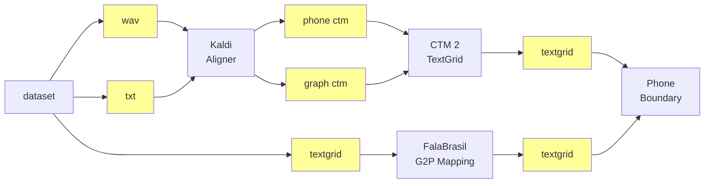
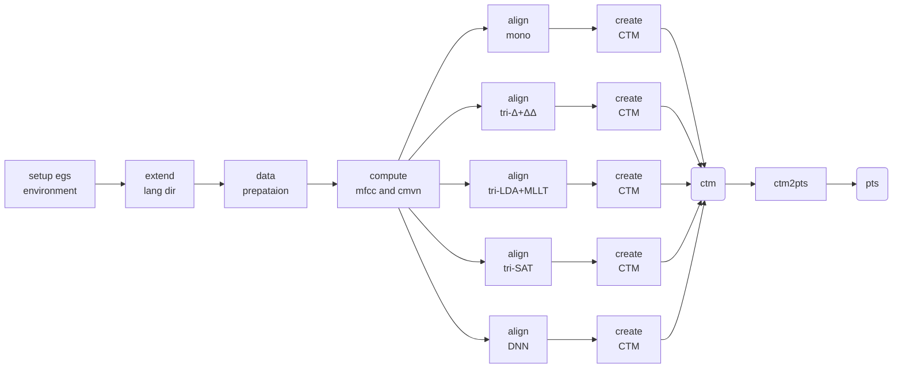

# UFPAlign v2.0: Larissa's BRACIS 2020 w/ Kaldi Scripts in Bash

The pipeline for generating the results for our
[2020 BRACIS paper](https://link.springer.com/chapter/10.1007%2F978-3-030-61377-8_44)
is depicted below.
Technically, when using our proposed Kaldi-based aligner, one will only 
have the audio (`.wav`) and the corresponding text transcription (`.txt`).
Kaldi, on the other hand, outputs a file in the CTM format, which must pass
through some scripting in order to be converted to the TextGrid's Praat input,
in which all info can be easily visualized. This is represented by the upper
of the schematic.




The lower half concerns some steps towards performing the comparison, in terms
of the phone boundary metric, between the alignment provided by Kaldi and the
ground truth provided by this hand-aligned dataset. This comparison is given by
a script that receives two TextGrid files as input: the automatic-aligned by
Kaldi, and the manual-aligned by some phonetician, which is found on this
dataset. As the `CTM2TextGrid` block builds a file based on FalaBrasil
phoneset, the original TextGrid of the male and female datasets have to pass
through the `G2P Mapping` block in order to have its phoneset converted, as
already explained.

Details over the phonetic alignment itself, including CTM generation,
conversion from CTM to TextGrid, and phonetic boundary calculation can be found
on another repo: https://gitlab.com/fb-align/kaldi-align.

[`g2p_map/`](./g2p_map/) dir contains scripts to convert the original phoneset
of the make-female dataset to the FalaBrasil representation, which is
compatible to what HTK and Kaldi acoustic models learn during training. Open
dir for more details.

**NOTE**: the lower half also mentions the "FalaBrasil G2P Mapping" which is
given by the scripts under [`scripts/20_bracis_kaldi/g2p_map/`](./g2p_map)
folder. As of Nov 2020 these scripts have become deprecated in favour of new
ones provided under [`scripts/ds2fb/`](../ds2fb).


## Disclaimer

For some technical problems only the male dataset was used for evaluation on
both 2016 PROPOR and 2020 BRACIS papers. The female is more problematic: it
contains a lot of errors in the TextGrid tiers, lots of cross-word
transcriptions, etc., which makes data treatment unfeasible. In fact I actually
tried to apply the G2P mapping scripts to the female dataset but it did not
work, and since processing the male dataset was already a lot of trouble by
itself, I didn't even bother fixing the female dataset in the first place. Iago
also didn't, so I didn't have any motivation to do so anyway.

:warning: new scripts in [`scripts/ds2fb/`](../ds2fb) dir have proven
this disclaimer untrue as it successfully parsed the female dataset.
Check it out.

## Update EURASIP 2021

PTS files were created from CTM previously generated and stored in 
`../../{male/female}/20_bracis_kaldi/`:

```text
$ tree ../../{female,male}/20_bracis_kaldi/*/ctm
../../female/20_bracis_kaldi/00mono/ctm            ../../male/20_bracis_kaldi/00mono/ctm
├── mono.graphemes.ctm                             ├── mono.graphemes.ctm
└── mono.phoneids.ctm                              └── mono.phoneids.ctm
../../female/20_bracis_kaldi/01tri1_delta/ctm      ../../male/20_bracis_kaldi/01tri1_delta/ctm
├── tri1.graphemes.ctm                             ├── tri1.graphemes.ctm
└── tri1.phoneids.ctm                              └── tri1.phoneids.ctm
../../female/20_bracis_kaldi/02tri2_mllt/ctm       ../../male/20_bracis_kaldi/02tri2_mllt/ctm
├── tri2b.graphemes.ctm                            ├── tri2b.graphemes.ctm
└── tri2b.phoneids.ctm                             └── tri2b.phoneids.ctm
../../female/20_bracis_kaldi/03tri3_sat/ctm        ../../male/20_bracis_kaldi/03tri3_sat/ctm
├── tri3b.graphemes.ctm                            ├── tri3b.graphemes.ctm
└── tri3b.phoneids.ctm                             └── tri3b.phoneids.ctm
../../female/20_bracis_kaldi/04_nnet2_2hidden/ctm  ../../male/20_bracis_kaldi/04nnet2_2hidden/ctm
├── dnn_2hidden.graphemes.ctm                      ├── dnn_2hidden.graphemes.ctm
└── dnn_2hidden.phoneids.ctm                       └── dnn_2hidden.phoneids.ctm
../../female/20_bracis_kaldi/04_nnet2_4hidden/ctm  ../../male/20_bracis_kaldi/04nnet2_4hidden/ctm
├── dnn_4hidden.graphemes.ctm                      ├── dnn_4hiddden.graphemes.ctm
└── dnn_4hidden.phoneids.ctm                       └── dnn_4hidden.phoneids.ctm

0 directories, 24 files
```

<details>
<summary>complete pipeline if the original models were not lost in the HDD</summary>


</details>
