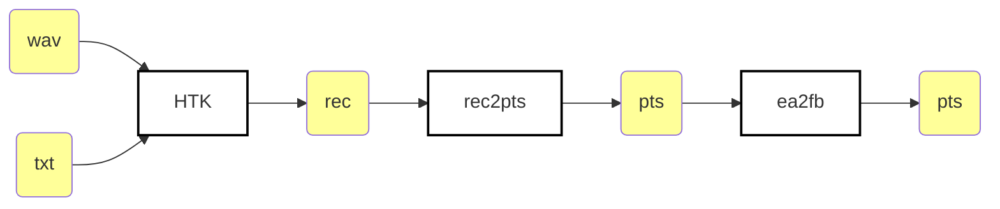

# EasyAlign: phonetic alignment with Praat

Source: http://latlcui.unige.ch/phonetique/easyalign.php

Here we are using just the acoustic model and phonetic dictionary created by
the G2P software that ships with EasyAlign package. Therefore the alignment
procedures is simplified to just calling HVite from command line.



Beware that the `ea2fb` routine ([`steps/ea2fb.py`](./steps/ea2fb.py)) is
necessary to perform the following map between phonemes that are in EasyAlign
pretrained acoustic model for BP and FalaBrasil's phoneset:

| EasyAlign | FalaBrasil     |
|:---------:|:--------------:|
| `/hh/`    | `/R/` or `/X/` |
| `/n4/`    | `/r/`          |
| `/t/ /S/` | `/tS/`         |
| `/d/ /Z/` | `/dZ/`         |

:warning: `.lab` files required by HVite are just txt with spaces substituted
by linebreaks, i.e., word lists.


## Phonetic dictionary

EasyAlign ships with a script named
`plugin_easyalign/lang/porbra/lapsG2UFPB.exe` which performs G2P conversion for
BP. However the execution is not really straightforward, since the wordlist as
input needs to be necessarily stored under a `tmp/` dir within the plugin dir,
and the output is stored under a file with a name hard-coded as
`dicionariofonetico.txt`. Besides, under Linux you must have `mono C#`
installed in order to execute this binary file. Last but not least, the
execution must be performed from inside EasyAlign's plugin dir as follows:

```bash
$ cd $HOME/plugin_easyalign/
$ mono lang/porbra/lapsG2UFPB.exe tmp/wlist.txt false lang/porbra/tabela
```

This assumes file `wlist.txt` contains one unique word per line, it is sorted
and stored under `plugin_easyalign/tmp` dir. If any of these conditions above
are violated, the dictionary will **not** be created.


[](https://ufpafalabrasil.gitlab.io/ "Visite o site do Grupo FalaBrasil") [](https://portal.ufpa.br/ "Visite o site da UFPA")

__Grupo FalaBrasil (2021)__ - https://ufpafalabrasil.gitlab.io/      
__Universidade Federal do Pará (UFPA)__ - https://portal.ufpa.br/     
Cassio Batista - https://cassota.gitlab.io/    
