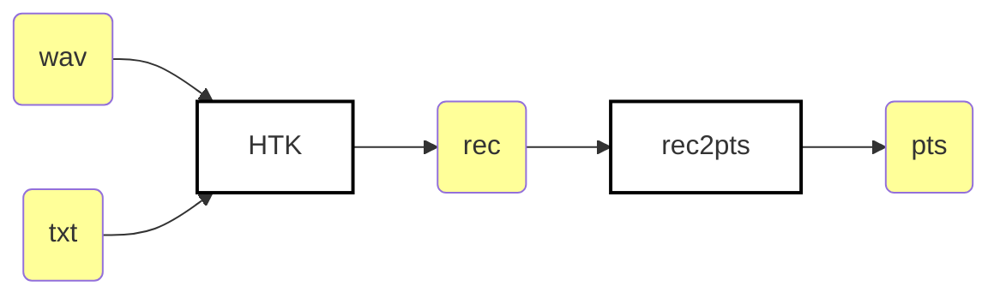

# UFPAlign v1.0: Iago's PROPOR 2016 w/ HTK's HVite

Source: https://gitlab.com/fb-align/hvite-align

The default output of FalaBrasi's HTK alinger is a TextGrid file, so we gotta
convert it to pts before combining it with the pts extracted from the original
male/female dataset in order to compute the phonetic boundary metric.

:warning: `.lab` files required by HVite are just txt with spaces substituted 
by linebreaks, i.e., word lists.

 

__Grupo FalaBrasil (2021)__ - https://ufpafalabrasil.gitlab.io/      
__Universidade Federal do Pará (UFPA)__ - https://portal.ufpa.br/     
Cassio Batista - https://cassota.gitlab.io/    
