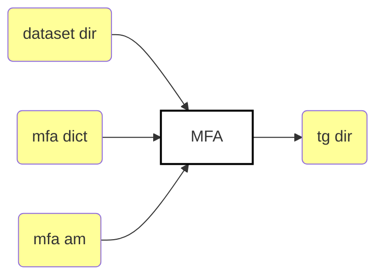
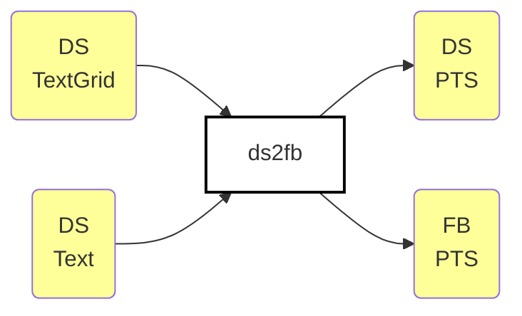
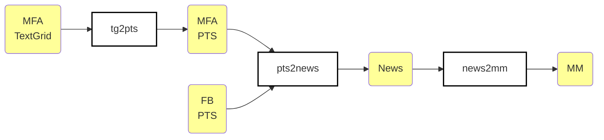
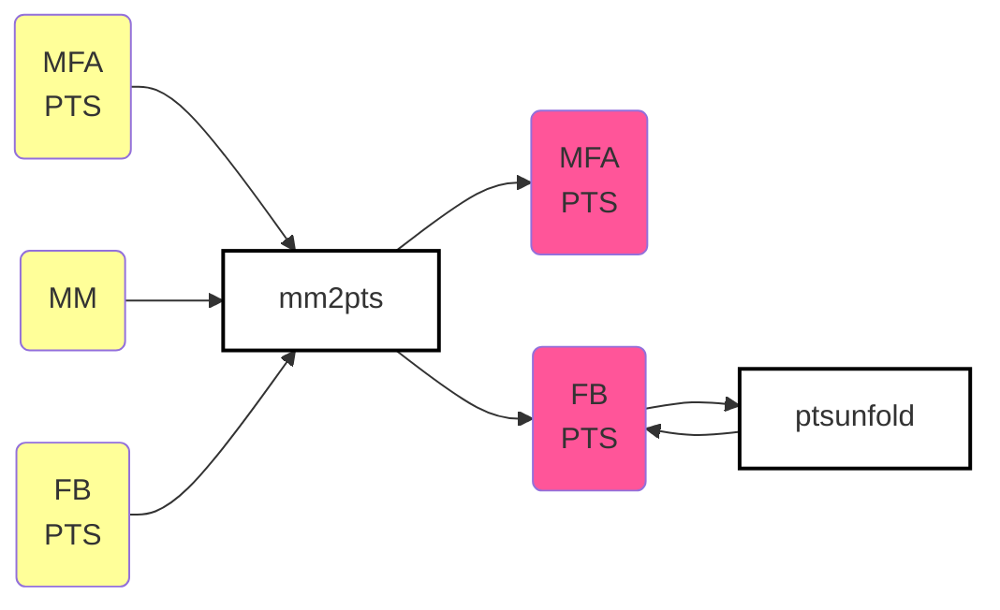

# Aligning using MFA's Pretrained Models

These simulations were performed using MFA's default acoustic and pronunciation
models for Portuguese, which we instruct to download and store into a folder
named `pretrained_models` in the installation and usage tutorial.



:warning: in the above flowchart, `dataset dir` represents either the male or
the female dataset, which are passed one at at time to MFA, but the output is
stored on the same directory since the files within each dataset dir have
different, non-overlapping names. `MFA` block is executed via `steps/align.sh`
script. `tg dir` is usually `workspace/tg/`.


## Align-only procedure

:warning: this assumes you have already [installed MFA 2.0.\* under an Anaconda
virtual environment](https://montreal-forced-aligner.readthedocs.io/en/latest/installation.html). Beware that `$CORPUS_DIR` var is either `male` or `female` dir.

This is how you would do it manually. But don't worry, script `steps/align.sh`
has it covered for us already.

```bash
(aligner) $ mfa align \
    $HOME/fb-gitlab/fb-audio-corpora/male-female-aligned/$CORPUS_DIR \
    $HOME/fb-gitlab/fb-audio-corpora/male-female-aligned/scripts/21_csl_mfa/dict_mfa.dict \
    $HOME/Documents/MFA/pretrained_models/acoustic/portuguese.zip \
    $HOME/fb-gitlab/fb-audio-corpora/male-female-aligned/scripts/21_csl_mfa/align_only/workspace/tg/
```

The problem is MFA outputs phonemes generated by Phonetisaurus'/Pynini's G2P
dictionary, which are in the ARPAbet format. Therefore we need to convert such
phonemes to the phone set FalaBrasil uses in its acoustic models, which is
based on SAMPA format:

```text
$ cd align_only && utils/get_phoneset.sh
mfa: A A+ A~ A~+ AX B D DJ E E+ E~ E~+ F G I I+ I~ I~+ IX K L LJ M N NJ O O+ O~ O~+ P R RR S SCH sil sp T TJ U U+ U~ U~+ UX V W W~ Z 
fb: a a~ b d dZ e e~ E f g i i~ j j~ J k l L m n o o~ O p r R s S t tS u u~ v w w~ X z Z
```

The following pipeline performs such conversion.


## Pipeline

The overall pipeline depends on the previous execution of the scripts under 
[`../ds2fb/`](../ds2fb) scripts, which parse the original dataset (a.k.a. DS, 
hand-aligned male/female) phoneset into FalaBrasil's (a.k.a. FB) under a PTS 
file format. It's highly recommended you check the documentation under that dir
first before proceeding to this one.



Now, after you generated FalaBrasil's PTS files parsed from the original
dataset, you may call the pipeline to match the phoneset from MFA to
FalaBrasil's with the familiar pipeline that makes used of the
[m2m aligner](https://github.com/letter-to-phoneme/m2m-aligner) to convert some
many-to-many relationship between phonemes into a one-to-one mapping.

For example, for the word `quebrou`, FalaBrasil phonemes `/o/` and `/w/` have
to be merged into a single one because in Phonetisaurus'/Pynini's ARPAbet
dictionary the sound is mapped to a single phone `/O+/`. Similarly, for the
word `índia`, MFA's dictionary yields two phonemes `/I+/` and `/N/` for the
nasals sound, which have to be merged to a single one since FalaBrasil's
outputs only `/i~/`.

```text
K  E  B  R  O+                  I+:N  DJ  I  AX
k  e  b  r  o:w                 i~    dZ  i  a
```

Therefore, the PTS output from `ds2fb` is the first input for the MFA
conversion. The second entry point is the TextGrid generated directly as output
of MFA alignment process, which is generated by `steps/align.sh` script.



M2M aligner generates a 1:1 mapping, so now we can correlate the timestamps
from both MFA and the original dataset (which was converted to FalaBrasil
already, don't forget that):



**NOTE**: PTS stands for "Phoneme TimeStamp" which is a two-column file
with phonemes in the first column and their timestamps in the second, separated
by a tab `\t` char. PTS are extracted directly from the TextGrid phoneme tier.


[](https://ufpafalabrasil.gitlab.io/ "Visite o site do Grupo FalaBrasil") [](https://portal.ufpa.br/ "Visite o site da UFPA")

__Grupo FalaBrasil (2021)__ - https://ufpafalabrasil.gitlab.io/      
__Universidade Federal do Pará (UFPA)__ - https://portal.ufpa.br/     
Cassio Batista - https://cassota.gitlab.io/    
