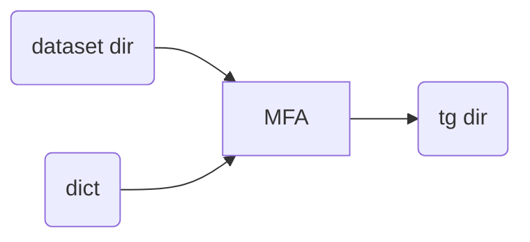

# Training an Acoustic Model and Aligning Simultaneously

These simulations were performed using MFA's default pronunciation
model for Portuguese only, but the acoustic model was trained on the very data
to be aligned, i.e., male/female `.wav` and `.txt` files.

Source: https://gitlab.com/fb-align/mfa-br



:warning: in the above flowchart, `dataset dir` represents either the male or
the female dataset, which are passed one at at time to MFA, but the output is
stored on the same directory since the files within each dataset dir have
different, non-overlapping names. `MFA` block is executed via 
`steps/train_and_align.sh` script. `tg dir` is usually `workspace/tg/`.


## Train and align procedure

:warning: this assumes you have already [installed MFA 2.0.\* under an Anaconda
virtual environment](https://montreal-forced-aligner.readthedocs.io/en/latest/installation.html). Beware that `$CORPUS_DIR` var is either `male` or `female` dir.

This is how you would do it manually. But don't worry, script 
`steps/train_and_align.sh` has it covered for us already.

```bash
(aligner) $ mfa train
      $HOME/fb-gitlab/fb-audio-corpora/male-female-aligned/$CORPUS_DIR \
      $HOME/fb-gitlab/fb-audio-corpora/male-female-aligned/dict_fb.dict \
      $HOME/fb-gitlab/fb-audio-corpora/male-female-aligned/scripts/21_eurasip_mfa/train_and_align/workspace/tg/
  done
```

:warning: notice we are not using `dict_mfa.dict` but `dict_fb.dict` instead.
Since we are rather training an acoustic model from scratch we could use what
phonetic dict we want, it does not necessarily needs to be one trained with MFA
G2P model for Portuguese. So yeah, we're using FalaBrasil's dict directly to
avoid the m2m aligner.

[](https://ufpafalabrasil.gitlab.io/ "Visite o site do Grupo FalaBrasil") [](https://portal.ufpa.br/ "Visite o site da UFPA")

__Grupo FalaBrasil (2021)__ - https://ufpafalabrasil.gitlab.io/      
__Universidade Federal do Pará (UFPA)__ - https://portal.ufpa.br/     
Cassio Batista - https://cassota.gitlab.io/    
