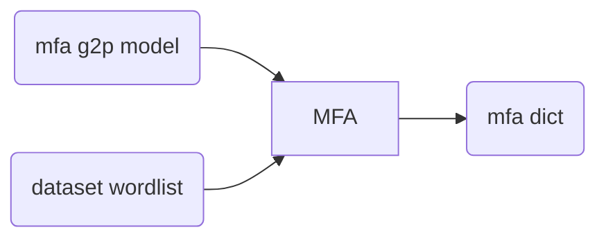
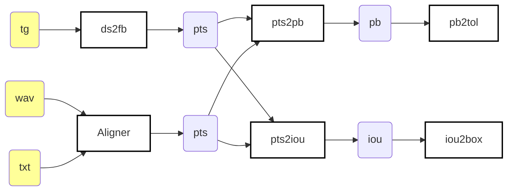

# Scripts

- `ds2fb/`: Parses TextGrid files' phonetic tier into a new format 
  called **p**honetic **t**ime**s**tamp (PTS for short), which is much 
  simpler and easy to parse later than a full TextGrid for phone boundary 
  calculation. It also performs a conversion from the original phoneset of the
  hand-aligned datasets to FalaBrasil's. This is an up-to-date version of the 
  `g2p_map` scripts. See "[Disclaimer](#disclaimer)" section.
- `20_bracis_kaldi/`: parses CTM files previously 
  generated by Larissa from out `fb-align/kaldi-align` repo scripts into PTS
  files, since the models were lost when we lost the backup HDD 
  (deceased in 2020, the partition simply won't mount). Fortunately, the CTM 
  files were stored in this repo under `{male,female}/20_bracis_kaldi/*/ctm/` 
  dirs. However since most models are being trained from scratch now following 
  Mini-libri recipe, **this should not be used any longer in the future**.
  This align may be usually referred also as UFPAlign 2.0.
- `22_eurasip_htk_*/`: generates `.rec` from Iago's aligner 
  (UFPAlign v1.0) and EasyAlign, both based on HVite. Then some pipeline of 
  scripts parse REC into PTS files.
- `22_eurasip_mfa/`: generates TextGrid files using MFA
  aligner, which is Kaldi-based. MFA outputs phonemes in ARPAbet format, so the
  pipeline parses TextGrid into PTS, and also converts the phoneset to
  FalaBrasil's SAMPA-based.
  - `align_only/`: contains scripts to generate textgrids via MFA
    using MFA's default pretrained acoustic and pronunciation models for
    Portuguese over both male and female datasets.
  - `train_and_align/`: contains scripts to generate
    textgrids by MFA, but using both male and female datasets as training set to 
    generate the acoustic model as well. The phonetic dictionary used was the 
    default generated by MFA's pretrained G2P model for Portuguese.
  - :warning: `falabrasil_trisat/`: contains script to generate PTS
    files using an triphone-based SAT acoustic model trained over all the
    FalaBrasil corpora. Unfortunately this didn't work out very well (yet).
- `22_eurasip_kaldi/`: generates CTM files using
  FalaBrasil-trained acoustic models with Kaldi. The pipeline then converts
  such files into PTS. The whole pipeline from model training is considered
  here (i.e., from monophones onwards).


## Requirements

| req   | url                                                               |
|:-----:|:-----------------------------------------------------------------:|
| data  | https://github.com/falabrasil/speech-datasets                     |
| conda | https://docs.conda.io/en/latest/miniconda.html                    |
| mfa   | https://github.com/MontrealCorpusTools/Montreal-Forced-Aligner    |
| m2m   | https://github.com/letter-to-phoneme/m2m-aligner                  |
| htk   | https://htk.eng.cam.ac.uk/                                        |
| kaldi | https://github.com/kaldi-asr/kaldi                                |

Most of the requirements are solved if you use the docker image under
`docker/simulation` dir. The following is a manual set up just in case you 
like to suffer. HTK has been a pain in Ubuntu 20 for me. MFA is easier now 
since everything is being hosted under `conda-forge` repo, including all Kaldi
dependencies.


### Data: Male Female (mf) Dataset

:warning: Install DVC with Google Drive support via `pip install dvc[gdrive]`.

```bash
$ git clone https://github.com/falabrasil/speech-datasets
$ cd speech-datasets
$ dvc pull -r align
```

### Conda

Either Anaconda or Miniconda will do.

### Montreal Forced Aligner (MFA)

```bash
$ conda create --name mfa python=3.8 --channel conda-forge montreal-forced-aligner --yes
$ conda activate mfa
(mfa) $ mfa model download acoustic portuguese
(mfa) $ mfa model download dictionary portuguese_brazil_ipa  # optional
(mfa) $ mfa model download g2p portuguese_g2p  # optional
```

<details>

<summary>old way</summary>

https://github.com/MontrealCorpusTools/Montreal-Forced-Aligner/issues/259#issuecomment-879523290

```bash
$ conda create -n mfa -c conda-forge openblas python=3.8 openfst pynini ngram baumwelch
$ conda activate mfa
(mfa) $ conda env config vars set LD_LIBRARY_PATH=$CONDA_PREFIX/lib
(mfa) $ pip install montreal-forced-aligner matplotlib seaborn pandas termcolor
(mfa) $ mfa thirdparty download
(mfa) $ mfa download acoustic portuguese
```

</details>

### Many-to-Many Aligner (M2M)

:warning: `make install` does not work so you either update your PATH env var
or pass the whole installation dir whenever calling m2m binary.

```bash
$ git clone https://github.com/letter-to-phoneme/m2m-aligner
$ cd m2m-aligner
$ make
$ sudo make install  # won't work
```

### HTK

Register to https://htk.eng.cam.ac.uk/ and then extract the `.tar.gz` file
somewhere.

:warning: You will probably need `gcc-multilib` if you are on a Debian-based 
OS, otherwise some 32-bit version of GCC gotta be installed.

```bash
$ cd htk
$ ./configure --disable-hslab --disable-hdecode --disable-hlmtools 
$ make -j 8
$ sudo make install
```

### Kaldi

:warning: MFA will download Kaldi binaries via conda so compilation can be
actually skipped.

```bash
$ git clone https://github.com/kaldi-asr/kaldi
$ cd kaldi/tools 
$ extras/check_dependencies.sh  # this will demand some things to be installed
$ extras/install_mkl.sh
$ make -j 8
$ cd kaldi/src
$ ./configure --shared
$ make depend -j 8
$ make -j 8
```

## Generate dict via MFA's pretrained pronunciation model (Pynini ARPAbet)

:warning: the dict complains at words with the `à` char, which luckily happen
to be only two: `à` and `às`. Therefore I removed them manually from the word
lists, then just re-inserted them back at the dict manually later.



:warning: this assumes you have already [installed MFA 2.0.\* under an Anaconda
virtual environment](https://montreal-forced-aligner.readthedocs.io/en/latest/installation.html).

```bash
(aligner) $ mfa g2p \
  $HOME/Documents/MFA/pretrained_models/g2p/portuguese_g2p.zip \
  $HOME/fb-gitlab/fb-audio-corpora/male-female-aligned/wlist.txt \
  $HOME/fb-gitlab/fb-audio-corpora/male-female-aligned/scripts/21_eurasip_mfa/dict_mfa.dict
```

## Generating Results

1. go to `ds2fb/` dir in order to parse male/female phoneset to FalaBrasil's
2. go to all folders specified by the `Aligner` block in the following
   flowchart and generate the `*.pts` alignment files
3. use `pts2pb.py` script to generate a phone boundary file `*.pb` from a pair
   of `*.pts` files: the ground truth from `ds2fb` procedure and the predicted
   from one of the aligners (HTK, Kaldi, MFA, etc.)
4. use `pts2iou.py` script to generate a intersection over union file `*.iou`
   from a pair of `*.pts` files, just like step 3.
5. pass all the `*.pb` file(s) to the `pb2tol.py` script to generate the stats
   table and log-based histogram of phonetic boundary distribution.
6. pass all the `*.iou` file(s) to the `iou2box.py` script to plot the boxplots
   of IoU scores in a per-phoneme basis

For the PTS files generation, you may check all files named `run.sh` under this
directory. For further convertion into phone boundary values and grouping under
tolerance thresholds, you may check script `gen_results.sh`.



In the flowchart above, `Aligner` represents any of the following folders:

| HTK                         | MFA                                                 | Kaldi              |
|:---------------------------:|:---------------------------------------------------:|:------------------:|
| `22_eurasip_htk_ufpalign`   | `22_eurasip_mfa_align_only`                         | `22_eurasip_kaldi` |
| `22_eurasip_htk_easyalign`  | `22_eurasip_mfa_train_and_align`                    |                    |
|                             | :no_entry_sign:`21_eurasip_mfa_falabrasil_trisat`   |                    |


## Disclaimer

:warning: `g2p_map/` was the first attempt to make a one-to-one alignment
between this dataset and the phonemes from FalaBrasil G2P lib for BRACIS 2020
paper and now it became outdated in favour of the scripts under `ds2fb` dir,
which are somehow much less complex and much more reliable. See 
[`20_bracis_kaldi`](./20_bracis_kaldi) dir for details regarding the old
version.


[](https://ufpafalabrasil.gitlab.io/ "Visite o site do Grupo FalaBrasil") [](https://portal.ufpa.br/ "Visite o site da UFPA")

__Grupo FalaBrasil (2022)__ - https://ufpafalabrasil.gitlab.io/      
__Universidade Federal do Pará (UFPA)__ - https://portal.ufpa.br/     
Cassio Batista - https://cassota.gitlab.io/    
