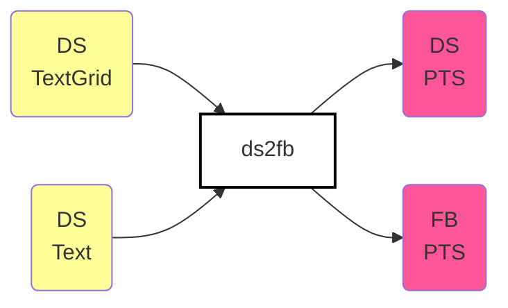
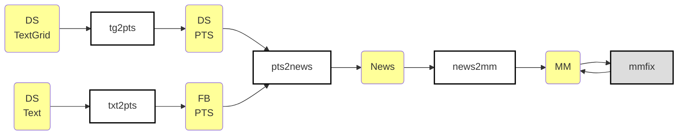
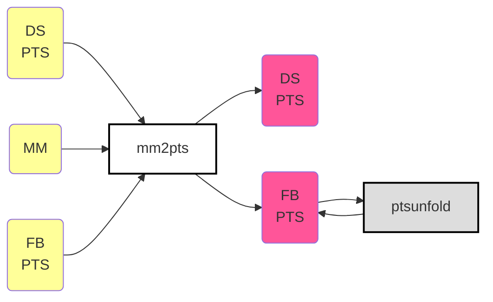

# ds2fb: Convert Original Dataset Phoneset to FalaBrasil's

These scripts were created in order to make the original phoneset of this
dataset match the phoneset of FalaBrasil phonetic dictionary. This is necessary
because all acoustic models trained by FalaBrasil group members use the
phoneset of our [NLP lib](https://gitlab.com/fb-nlp/nlp-generator), so each
automatic phonetic aligner we use might output some kind of format that is
composed by this phoneset. The following script highlights the two different
sets of phonemes: `ds` stands for the original, hand-aligned that came shipped
with this dataset by default, while `fb` stands for the FalaBrasil phoneset
generated by our G2P software under our NLP lib.

```text
$ bash utils/get_phoneset.sh 
ds: _  4  6  6~ a   a~ b  d  e  e~ E  f  g  h  h/ h\ i  i~ j  j~ J  k  l  L  m  n  o  o~ O  p  r  s  S  t  u  u~ v  w  w~ z  Z
fb: a  a~ b  d  dZ  e  e~ E  f  g  i  i~ j  j~ J  k  l  L  m  n  o  o~ O  p  r  R  s  S  t  tS u  u~ v  w  w~ X  z  Z
```

The two main entry points for the scripts are the files under directories
`{male/female}/textgrid/*.TextGrid` and `{male/female}/*.txt`. The output are
equivalent pts files for both datasets.

**NOTE**: PTS stands for "**p**honeme **t**ime**s**tamp" which is a two-column
file with phonemes in the first column and their timestamps in the second,
separated by a tab `\t` char. PTS are extracted directly from the TextGrid
phoneme tier.



The mapping `ds2fb` is not always one to one, so we had to come up with some
strategy to make it 1:1. The following pipeline explains this strategy. The
trick is first to generate an alignment file via 
[M2M aligner software](https://github.com/letter-to-phoneme/m2m-aligner), so a
mapping which was previously many-to-many will now be one-to-one.



Then we can use this 1:1 mapping and combine with the timestamps store in the
previous PTS file, to generate a new PTS file in which both `ds` and `fb`
representations will have the same number of lines:




## Scripts under `steps/` dir

- `tg2pts`: extracts only the phoneme tier from a textgrid file into a `pts`
  format, which is just the phoneme token alongside its timestamp mark. This is
  used for the original `ds` pts.
```text
 $ grep 'name = "phones' ../../male/textgrid/M-110.TextGrid -A 30 && head workspace/pts_in/ds/M-110.pts 
        name = "phones"                        
        xmin = 0 
        xmax = 2.71689126493078 
        intervals: size = 39 
        intervals [1]:
            xmin = 0 
            xmax = 0.09544739414440073 
            text = "i~" 
        intervals [2]:
            xmin = 0.09544739414440073                  "i~"  0.09544739414440073
            xmax = 0.20478970293817156                  "f"   0.20478970293817156
            text = "f"                                  "e"   0.26766153049464947
        intervals [3]:                                  "l"   0.31372197807405655
            xmin = 0.20478970293817156                  "i"   0.40929787391968375
            xmax = 0.26766153049464947                  "Z"   0.5157360562798203
            text = "e"                                  "m"   0.5881753358556807
        intervals [4]:                                  "e~"  0.6984558092968314
            xmin = 0.26766153049464947                  "j~"  0.7323519250228969
            xmax = 0.31372197807405655                  "n"   0.7550404540975819
            text = "l" 
        intervals [5]:
            xmin = 0.31372197807405655 
            xmax = 0.40929787391968375 
            text = "i" 
        intervals [6]:
            xmin = 0.40929787391968375 
            xmax = 0.5157360562798203 
            text = "Z" 
        intervals [7]:
            xmin = 0.5157360562798203 
            xmax = 0.5881753358556807 
```
- `txt2pts`: makes use of a phonetic dictionary file to parse raw text into the
  `pts` format, which is just the phoneme token alongside its timestamp mark.
  this is used for the falabrasil `fb` pts.
```text
 $ cat ../../male/M-110.txt && head workspace/pts_in/fb/M-110.pts 
infelizmente não compareci ao encontro                  "i~"    0.000
                                                        "f"     0.000
                                                        "e"     0.000
                                                        "l"     0.000
                                                        "i"     0.000
                                                        "z"     0.000
                                                        "m"     0.000
                                                        "e~"    0.000
                                                        "tS"    0.000
                                                        "i"     0.000
```
- `pts2news`: generates a `news` file from a `pts`, which ignores timestamps
  and just correlates `fb` and `ds` phoneme tokens in a line-by-line
  fashion. each phone is separated by a space char, and falabrasil and dataset
  phonesets are separated in a line by a tab `\t` char.
```text
$ head workspace/ali_male.news | expand -t 40
6 k e s t a~ w~ f o j h/ e t o~ m a d 6 n u k o~ n g 4 E s u                    a k e s t a~ w~ f o j R e t o m a d a n u k o~ g r E s u 
l e j l 6 t e~ j~ m u~ m l i~ n d u Z a h\ d Z i~ m                             l e j l a t e~ j~ u~ l i~ d u Z a R dZ i~ 
u a n a w f a b e t S i Z m u E 6 v e h/ g o~ J 6 d u p a i S                   u a n a w f a b e tS i z m u E a v e R g o~ J a d u p a i j s 
6 k a z 6 f o j v e~ n d Z i d 6 s e~ j~ m p 4 E s 6                            a k a z a f o j v e~ dZ i d a s e~ j~ p r E s a 
t 4 a b a L a~ n d u k o~ u n i a~ w~ h e~ n d Z i m u~ j~ n t u m a j S        t r a b a L a~ d u k o~ u~ n i a~ w~ R e~ dZ i m u j~ t u m a j s 
h e s e b i n O s u a m i g u p a 4 6 a w m u s a h                             R e s e b i n O s u a m i g u p a r a a w m o s a X 
6 Z u s t S i s 6 E 6 u~ n i k 6 v e~ n s e d o 4 6                             a Z u s tS i s a E a u n i k a v e~ s e d o r a 
i s u s i h/ e z o w v e 4 a d Z i f O h/ m 6 t 4 a~ n k w i l 6                i s u s i R e z o w v e r a dZ i f o R m a t r a~ k w i l a 
u S p e S k i z a d o 4 i z a k 4 e d Z i t a~ w~ n E s 6 t e o 4 i 6           u j s p e s k i z a d o r i s a k r e dZ i t a~ w~ n e s a t e o r i a 
s e j k i a t S i~ Z i 4 e~ m u z u o b Z e t S i v u                           s e j k i a tS i~ Z i r e~ m u s u o b Z e tS i v u
```
- `news2mm`: calls M2M aligner to extract frequency-based rules from `news`
  file and writes `fb` and `ds` phoneme token representations with the same
  length into a `.mm` file format. Some phonemes are merged in while 
  (eventually and more rarely) some others are split out. Phonemes are grouped
  together by a colon `:` char.
```text
$ head workspace/ali_male.mm | expand -t 40
6|k|e|s|t|a~|w~|f|o|j|h/|e|t|o~|m|a|d|6|n|u|k|o~:n|g|4|E|s|u|                   a|k|e|s|t|a~|w~|f|o|j|R|e|t|o|m|a|d|a|n|u|k|o~|g|r|E|s|u|
l|e|j|l|6|t|e~|j~:m|u~:m|l|i~:n|d|u|Z|a|h\|d:Z|i~:m|                            l|e|j|l|a|t|e~|j~|u~|l|i~|d|u|Z|a|R|dZ|i~|
u|a|n|a|w|f|a|b|e|t:S|i|Z|m|u|E|6|v|e|h/|g|o~|J|6|d|u|p|a|i|S|                  u|a|n|a|w|f|a|b|e|tS|i|z|m|u|E|a|v|e|R|g|o~|J|a|d|u|p|a|i:j|s|
6|k|a|z|6|f|o|j|v|e~:n|d:Z|i|d|6|s|e~|j~:m|p|4|E|s|6|                           a|k|a|z|a|f|o|j|v|e~|dZ|i|d|a|s|e~|j~|p|r|E|s|a|
t|4|a|b|a|L|a~:n|d|u|k|o~|u|n|i|a~|w~|h|e~:n|d:Z|i|m|u~|j~:n|t|u|m|a|j|S|       t|r|a|b|a|L|a~|d|u|k|o~|u~|n|i|a~|w~|R|e~|dZ|i|m|u|j~|t|u|m|a|j|s|
h|e|s|e|b|i|n|O|s|u|a|m|i|g|u|p|a|4|6|a|w|m|u|s|a|h|                            R|e|s|e|b|i|n|O|s|u|a|m|i|g|u|p|a|r|a|a|w|m|o|s|a|X|
6|Z|u|s|t:S|i|s|6|E|6|u~|n|i|k|6|v|e~:n|s|e|d|o|4|6|                            a|Z|u|s|tS|i|s|a|E|a|u|n|i|k|a|v|e~|s|e|d|o|r|a|
i|s|u|s|i|h/|e|z|o|w|v|e|4|a|d:Z|i|f|O|h/|m|6|t|4|a~:n|k|w|i|l|6|               i|s|u|s|i|R|e|z|o|w|v|e|r|a|dZ|i|f|o|R|m|a|t|r|a~|k|w|i|l|a|
u|S|p|e|S|k|i|z|a|d|o|4|i|z|a|k|4|e|d:Z|i|t|a~|w~|n|E|s|6|t|e|o|4|i|6|          u:j|s|p|e|s|k|i|z|a|d|o|r|i|s|a|k|r|e|dZ|i|t|a~|w~|n|e|s|a|t|e|o|r|i|a|
s|e|j|k|i|a|t:S|i~|Z|i|4|e~|m|u|z|u|o|b|Z|e|t:S|i|v|u|                          s|e|j|k|i|a|tS|i~|Z|i|r|e~|m|u|s|u|o|b|Z|e|tS|i|v|u|
```
- `mm2pts`: parses `.mm` aligned file back into `pts` format. Now two files
  with the same basename for both falabrasil and dataset original alignments,
  e.g. `workspace/tg_in/M-003.pts` and `workspace/tg_out/M-003.pts`, should
  have the same number of lines, which will make the phone boundary calculation
  1:1.
```text
$ paste workspace/pts_out/{ds,fb}/M-110.pts | head
i~      0.095   i~      0.095
f       0.205   f       0.205
e       0.268   e       0.268
l       0.314   l       0.314
i       0.409   i       0.409
Z       0.516   z       0.516
m       0.588   m       0.588
e~:j~:n 0.755   e~      0.755
t:S     0.868   tS      0.868
i       0.886   i       0.886
```
- `mmfix.py`: m2m-aligner produces some wrong alignments such as `d|Z` instead
  of `d:Z`, so this script does a lot of replacings to correct such
  misalignments.
- `ptsunfold.py`: after `mm2pts` the pts files contain merged phones, which is
  not a good thing to encounter after applying some automatic phonetic aligner
  using FalaBrasil dict, because the aligner will not output merged phones.
  Therefore this scripts unfolds them, so something like `i:j` or `u:j`, 
  with a single timestamp will become two individual phones with two individual
  timestamps linearly distributed with respect to the previous single one.


## Requirements

- m2m aligner: https://github.com/letter-to-phoneme/m2m-aligner
- Python 3 + termcolor

[](https://ufpafalabrasil.gitlab.io/ "Visite o site do Grupo FalaBrasil") [](https://portal.ufpa.br/ "Visite o site da UFPA")

__Grupo FalaBrasil (2020)__ - https://ufpafalabrasil.gitlab.io/      
__Universidade Federal do Pará (UFPA)__ - https://portal.ufpa.br/     
Cassio Batista - https://cassota.gitlab.io/    
